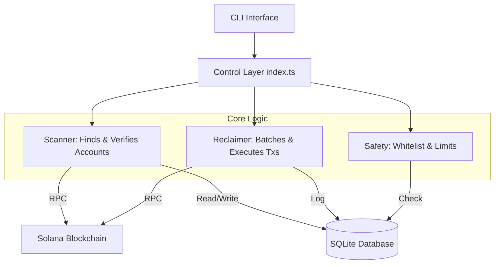

# Kora Rent Reclaimer - Deep Dive

## Executive Summary

This document provides an in-depth technical analysis of the **Kora Rent Reclaimer Bot**, an automated system for recovering rent-locked SOL from Solana accounts sponsored by Kora node operators.

It addresses a critical operational gap in the Kora paymaster model: **silent capital loss**. By automating the tracking and reclamation of rent from inactive accounts, this tool helps operators recover funds while maintaining strict safety controls and respecting Solana's authority model.

---

## 1. The Problem: Silent Capital Loss

### The Kora Paymaster Model
Kora is a paymaster service that allows apps to sponsor transaction fees for users.
*   **User benefits:** Gasless transactions (UX).
*   **Operator pays:** Transaction fees + **Rent** for new accounts.

### Why Rent Gets Locked
When a Kora node sponsors a transaction that creates accounts (e.g., token accounts for first-time token recipients), the operator pays for:
1.  **Transaction fees** (~0.000005 SOL) - Immediately consumed.
2.  **Rent** (~0.002 SOL per account) - **Locked** in the created account indefinitely.

### The Scale of the Issue
Consider an operator sponsoring 10,000 transactions over 6 months:
*   5,000 new Token Accounts created = **10.15 SOL locked**.
*   1,000 NFT metadata accounts created = **5.60 SOL locked**.
*   **Total Hidden Cost: ~15.75 SOL**

If 70% of those accounts become inactive or empty, over **11 SOL** sits recoverable but unnoticed. Most operators never realize this capital exists.

---

## 2. Authority vs Fee Payer (Critical Distinction)

> **Paying for an account's creation does NOT grant you the right to close it.**

This is the most critical concept in Solana rent reclamation.

### Solana's Permission Model
*   **Fee Payer (Kora Operator):** Signs the transaction to pay for creation. Has **NO** ownership rights by default.
*   **Close Authority:** The specific address authorized to close the account and withdraw rent.

### What Can Actually Be Reclaimed?

| Account Type | Close Authority | Can Operator Reclaim? |
| :--- | :--- | :--- |
| **User's Token Account** | User Wallet | ❌ **NO** - User owns it. |
| **Operator-Managed Account** | Operator | ✅ **YES** - Operator is explicit authority. |
| **User's System Account** | User (Private Key) | ❌ **NO** - Requires user private key. |
| **Program PDA** | Program/Operator | ⚠️ **MAYBE** - Depends on program logic. |

**The Solution:** This bot strictly verifies the on-chain `closeAuthority` field. It **only** attempts to reclaim accounts where the operator is explicitly listed as the authority. This prevents any unauthorized access or "draining" of user wallets.

---

## 3. Use Case Scenarios

### Scenario A: Gaming Platform (Operator-Owned Inventory)
A game creates temporary token accounts for user sessions. The operator is set as the authority.
*   **Action:** Bot scans, finds empty session accounts, reclaims 100% of rent.
*   **Result:** sustainable free-to-play model.

### Scenario B: NFT Marketplace
Marketplace sponsors metadata accounts for minting.
*   **Action:** If the operator retained update/close authority on metadata (common for collections), the bot reclaims rent when NFTs are burned.

### Scenario C: User Airdrops
Operator sponsors standard associated token accounts (ATAs) for users.
*   **Action:** Bot detects these are user-owned (Authority != Operator).
*   **Result:** **Skips entirely.** Operator cannot reclaim these, avoiding a security incident.

---

## 4. Technical Architecture

### High-Level Design

### Module Breakdown

#### `src/scanner.ts` - The "Eyes"
*   **Role:** Identify accounts and verify authority.
*   **Key Logic:**
    1.  Fetch account info via `getMultipleAccounts` (batching).
    2.  Decode data using SPL Token `AccountLayout`.
    3.  Compare `closeAuthority` vs `Operator Public Key`.
    4.  **Crucial:** If they don't match, mark as `skipped`.

#### `src/safety.ts` - The Guardrails
*   **Role:** Prevent accidents.
*   **Checks:**
    1.  **Whitelist:** explicit list of "do not touch" accounts.
    2.  **Idle Time:** Ensure account has been empty/inactive for `MIN_IDLE_DAYS` (default 7).
    3.  **Budget Cap:** Max SOL to reclaim per run (e.g., 10 SOL) to limit impact of any bugs.

#### `src/reclaim.ts` - The Execution
*   **Role:** Construct and send transactions.
*   **Efficiency:** Batches up to **10 close instructions** per single transaction.
    *   Cost per close: ~5,000 lamports.
    *   Cost per batch (10 closes): ~5,000 lamports.
    *   **Savings:** ~90% on transaction fees.

#### `src/database.ts` - The Memory
*   **Tech:** `sql.js` (SQLite).
*   **Role:** Persistent tracking without external dependencies.
*   **Data:** Stores account status, discovery time, and full reclaim history (tx signatures).

---

## 5. Safety Mechanisms (Defense in Depth)

1.  **Authority Verification:** The primary gate. Code physically cannot generate a close instruction if the operator keypair doesn't match the on-chain authority.
2.  **Dry-Run Mode:** `--dry-run` flag simulates everything (RPC calls, checks) but skips the final signature.
3.  **Mainnet Confirmation:** Interactive prompt ("Are you sure?") required on Mainnet-beta.
4.  **Budget Limits:** Prevents runaway scripts from draining too many accounts at once.
5.  **Whitelist:** Manual override to protect specific accounts.

---

## 6. Operational Considerations

### Performance
*   **Scanning:** RPC-intensive. Used `getMultipleAccounts` and a 100ms delay between batches to respect public RPC rate limits.
*   **Database:** SQLite is file-based, making it easy to backup (`.db` file) but non-concurrent. Perfect for a CLI tool.

### Security
*   **Keys:** Operator keypair is loaded from local filesystem (never transmitted).
*   **RPC:** Compatible with standard Solana JSON RPC.
*   **Auditability:** Every action produces a JSON log file in `logs/` and a database entry.

---

## 7. Future Enhancements

*   **Dashboard:** A local web UI to visualize "Total Rent Locked" vs "Reclaimed".
*   **Kora Integration:** Direct API hooks to Kora node logs for real-time account discovery.
*   **Hardware Wallet Support:** Allow signing reclaims via Ledger for high-value operator keys.

---

## Conclusion

The Kora Rent Reclaimer transforms vague "operational overhead" into a recoverable asset. By strictly adhering to Solana's authority model, it provides a safe, transparent, and automated way for operators to optimize their capital efficiency.
